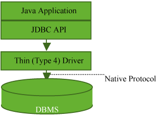
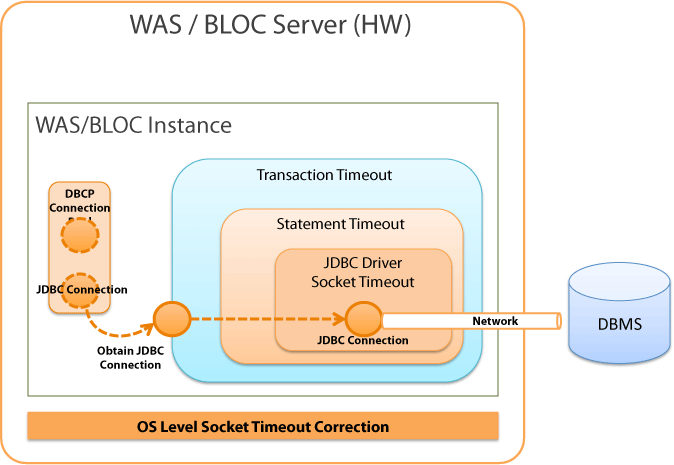
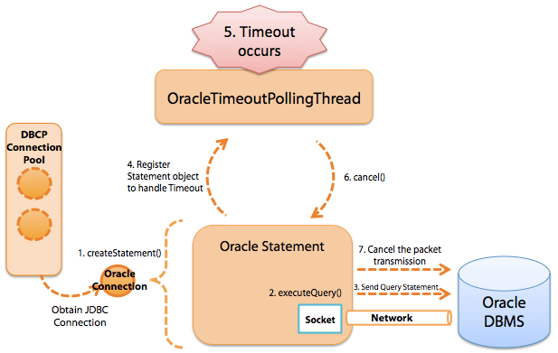
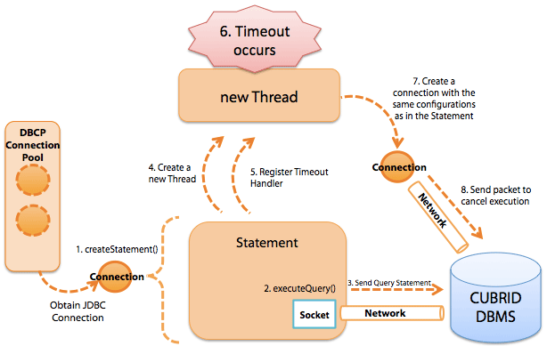

## 【转载】JDBC超时原理与设置  
    
　抄录自[博客园cnblogs](https://www.cnblogs.com/iceJava/p/4497763.html)，因为担心以后找不到，因此抄录之。感谢分享的大神！  
　英文原版：[http://www.cubrid.org/blog/dev-platform/understanding-jdbc-internals-and-timeout-configuration](http://www.cubrid.org/blog/dev-platform/understanding-jdbc-internals-and-timeout-configuration)    
 

　恰当的JDBC超时设置能够有效地减少服务失效的时间。本文将对数据库的各种超时设置及其设置方法做介绍。  

　**真实案例：应用服务器在遭到DDos攻击后无法响应**   

　　在遭到DDos攻击后，整个服务都垮掉了。由于第四层交换机不堪重负，网络变得无法连接，从而导致业务系统也无法正常运转。安全组很快屏蔽了所有的DDos攻击，并恢复了网络，但业务系统却还是无法工作。 通过分析系统的thread dump发现，业务系统停在了JDBC API的调用上。20分钟后，系统仍处于WAITING状态，无法响应。30分钟后，系统抛出异常，服务恢复正常。  

　　为什么我们明明将query timeout设置成了3秒，系统却持续了30分钟的WAITING状态？为什么30分钟后系统又恢复正常了？ 当你对理解了JDBC的超时设置后，就能找到问题的答案。  

　**为什么我们要了解JDBC？**   

　　当遇到性能问题或系统出错时，业务系统和数据库通常是我们最关心的两个部分。在公司里，这两个部分是交由两个不同的部门来负责的，因此各个部门都会集中精力地在自身领域内寻找问题，这样的话，在业务系统和数据库之间的部分就会成为一个盲区。对于Java应用而言，这个盲区就是DBCP数据库连接池和JDBC，本文将集中介绍JDBC。  

　**什么是JDBC？**  

　　JDBC是Java应用中用来连接关系型数据库的标准API。Sun公司一共定义了4种类型的JDBC，我们主要使用的是第4种，该类型的Driver完全由Java代码实现，通过使用socket与数据库进行通信。  

　  
　　　图1 JDBC Type 4.

　　第4种类型的JDBC通过socket对字节流进行处理，因此也会有一些基本网络操作，类似于HttpClient这种用于网络操作的代码库。当在网络操作中遇到问题的时候，将会消耗大量的cpu资源，并且失去响应超时。如果你之前用过HttpClient，那么你一定遇到过未设置timeout造成的错误。同样，第4种类型的JDBC，若没有合理地设置socket timeout，也会有相同的错误——连接被阻塞。  

　　接下来，就让我们来学习一下如何正确地设置socket timeout，以及需要考虑的问题。  

　　应用与数据库间的timeout层级  

　  
　　　图2 Timeout Class.

　　上图展示了简化后应用与数据库间的timeout层级。（译者注：WAS/BLOC是作者公司的具体应用名称，无需深究） 

　　高级别的timeout依赖于低级别的timeout，只有当低级别的timeout无误时，高级别的timeout才能确保正常。例如，当socket timeout出现问题时，高级别的statement timeout和transaction timeout都将失效。 

　　我们收到的很多评论中提到： 

　　**引用：**  

　　即使设置了statement timeout，当网络出错时，应用也无法从错误中恢复。
　　statement timeout无法处理网络连接失败时的超时，它能做的仅仅是限制statement的操作时间。网络连接失败时的timeout必须交由JDBC来处理。 

　　JDBC的socket timeout会受到操作系统socket timeout设置的影响，这就解释了为什么在之前的案例中，JDBC连接会在网络出错后阻塞30分钟，然后又奇迹般恢复，即使我们并没有对JDBC的socket timeout进行设置。 

　　DBCP连接池位于图2的左侧，你会发现timeout层级与DBCP是相互独立的。DBCP负责的是数据库连接的创建和管理，并不干涉timeout的处理。当连接在DBCP中创建，或是DBCP发送校验query检查连接有效性的时候，socket timeout将会影响这些过程，但并不直接对应用造成影响。 

　　当在应用中调用DBCP的getConnection()方法时，你可以设置获取数据库连接的超时时间，但是这和JDBC的timeout毫不相关。 

　   
　　　图3 Timeout for Each Levels.

　**什么是Transaction Timeout？**   

　　transaction timeout一般存在于框架（Spring, EJB）或应用级。transaction timeout或许是个相对陌生的概念，简单地说，transaction timeout就是“statement Timeout * N（需要执行的statement数量） + @（垃圾回收等其他时间）”。transaction timeout用来限制执行statement的总时长。 

　　例如，假设执行一个statement需要0.1秒，那么执行少量statement不会有什么问题，但若是要执行100,000个statement则需要10,000秒（约7个小时）。这时，transaction timeout就派上用场了。EJB CMT (Container Managed Transaction)就是一种典型的实现，它提供了多种方法供开发者选择。但我们并不使用EJB，Spring的transaction timeout设置会更常用一些。在Spring中，你可以使用下面展示的XML或是在源码中使用@Transactional注解来进行设置。 

　　xml代码：  
<pre>
    &lt;tx:attributes&gt;  
        &lt;tx:method name="…" timeout="3"/&gt;  
    &lt;/tx:attributes&gt; 
</pre> 
　　Spring提供的transaction timeout配置非常简单，它会记录每个事务的开始时间和消耗时间，当特定的事件发生时就会对消耗时间做校验，当超出timeout值时将抛出异常。 

　　Spring中，数据库连接被保存在ThreadLocal里，这被称为事务同步（Transaction Synchronization），与此同时，事务的开始时间和消耗时间也被保存下来。当使用这种代理连接创建statement时，就会校验事务的消耗时间。EJB CMT的实现方式与之类似，其结构本身也十分简单。 

　　当你选用的容器或框架并不支持transaction timeout这一特性，你可以考虑自己来实现。transaction timeout并没有标准的API。Lucy框架的1.5和1.6版本都不支持transaction timeout，但是你可以通过使用Spring的Transaction Manager来达到与之同样的效果。 

　　假设某个事务中包含5个statement，每个statement的执行时间是200ms，其他业务逻辑的执行时间是100ms，那么transaction timeout至少应该设置为1,100ms（200 * 5 + 100）。 

　**什么是Statement Timeout？**  

　　statement timeout用来限制statement的执行时长，timeout的值通过调用JDBC的java.sql.Statement.setQueryTimeout(int timeout) API进行设置。不过现在开发者已经很少直接在代码中设置，而多是通过框架来进行设置。 

　　以iBatis为例，statement timeout的默认值可以通过sql-map-config.xml中的defaultStatementTimeout 属性进行设置。同时，你还可以设置sqlmap中select，insert，update标签的timeout属性，从而对不同sql语句的超时时间进行独立的配置。 

　　如果你使用的是Lucy1.5或1.6版本，通过设置queryTimeout属性可以在datasource层面对statement timeout进行设置。 

　　statement timeout的具体值需要依据应用本身的特性而定，并没有可供推荐的配置。 

　**JDBC的statement timeout处理过程**   

　　不同的关系型数据库，以及不同的JDBC驱动，其statement timeout处理过程会有所不同。其中，Oracle和MS SQLServer的处理相类似，MySQL和CUBRID类似。 

　**Oracle JDBC Statement的QueryTimeout处理过程**  

　　1. 通过调用Connection的createStatement()方法创建statement 

　　2. 调用Statement的executeQuery()方法 

　　3. statement通过自身connection将query发送给Oracle数据库 

　　4. statement在OracleTimeoutPollingThread（每个classloader一个）上进行注册 

　　5. 达到超时时间 

　　6. OracleTimeoutPollingThread调用OracleStatement的cancel()方法 

　　7. 通过connection向正在执行的query发送cancel消息 

　   
　　　图4 Query Timeout Execution Process for Oracle JDBC Statement.

　**JTDS (MS SQLServer) Statement的QueryTimeout处理过程** 

　　1. 通过调用Connection的createStatement()方法创建statement 

　　2. 调用Statement的executeQuery()方法 

　　3. statement通过自身connection将query发送给MS SqlServer数据库 

　　4. statement在TimerThread上进行注册 

　　5. 达到超时时间 

　　6. TimerThread调用JtdsStatement实例中的TsdCore.cancel()方法 

　　7. 通过ConnectionJDBC向正在执行的query发送cancel消息 

　  
　　　图5 QueryTimeout Execution Process for JTDS (MS SQLServer) Statement.

　**MySQL JDBC Statement的QueryTimeout处理过程**   

　　1. 通过调用Connection的createStatement()方法创建statement 

　　2. 调用Statement的executeQuery()方法 

　　3. statement通过自身connection将query发送给MySQL数据库 

　　4. statement创建一个新的timeout-execution线程用于超时处理

　　5. 5.1版本后改为每个connection分配一个timeout-execution线程 

　　6. 向timeout-execution线程进行注册 

　　7. 达到超时时间 

　　6. TimerThread调用JtdsStatement实例中的TsdCore.cancel()方法 

　　7. timeout-execution线程创建一个和statement配置相同的connection 

　　8. 使用新创建的connection向超时query发送cancel query（KILL QUERY “connectionId”） 

　  
　　　图6 QueryTimeout Execution Process for MySQL JDBC Statement (5.0.8).

　**CUBRID JDBC Statement的QueryTimeout处理过程**   

　　1. 通过调用Connection的createStatement()方法创建statement 

　　2. 调用Statement的executeQuery()方法 

　　3. statement通过自身connection将query发送给CUBRID数据库 

　　4. statement创建一个新的timeout-execution线程用于超时处理 

　　5. 5.1版本后改为每个connection分配一个timeout-execution线程 

　　6. 向timeout-execution线程进行注册 

　　7. 达到超时时间 

　　6. TimerThread调用JtdsStatement实例中的TsdCore.cancel()方法 

　　7. timeout-execution线程创建一个和statement配置相同的connection 

　　8. 使用新创建的connection向超时query发送cancel消息 

　  
　　　图7 QueryTimeout Execution Process for CUBRID JDBC Statement.

　**什么是JDBC的socket timeout？** 

　　第4种类型的JDBC使用socket与数据库连接，数据库并不对应用与数据库间的连接超时进行处理。 

　　JDBC的socket timeout在数据库被突然停掉或是发生网络错误（由于设备故障等原因）时十分重要。由于TCP/IP的结构原因，socket没有办法探测到网络错误，因此应用也无法主动发现数据库连接断开。如果没有设置socket timeout的话，应用在数据库返回结果前会无期限地等下去，这种连接被称为dead connection。 

　　为了避免dead connections，socket必须要有超时配置。socket timeout可以通过JDBC设置，socket timeout能够避免应用在发生网络错误时产生无休止等待的情况，缩短服务失效的时间。 

　　不推荐使用socket timeout来限制statement的执行时长，因此socket timeout的值必须要高于statement timeout，否则，socket timeout将会先生效，这样statement timeout就变得毫无意义，也无法生效。 

　　下面展示了socket timeout的两个设置项，不同的JDBC驱动其配置方式会有所不同。 

　　　(1)socket连接时的timeout：通过Socket.connect(SocketAddress endpoint, int timeout)设置  
　　　(2)socket读写时的timeout：通过Socket.setSoTimeout(int timeout)设置  
　　通过查看CUBRID，MySQL，MS SQL Server (JTDS)和Oracle的JDBC驱动源码，我们发现所有的驱动内部都是使用上面的2个API来设置socket timeout的。 

　　下面是不同驱动的socket timeout配置方式。

|     JDBC Driver    | connectTimeout 配置项 |socketTimeout 配置项|  url格式  | 示例 
|----------------------|:------------:|:---------:|:------|------|   
|MySQL Driver   |connectTimeout （默认值：0，单位：ms）|socketTimeout （默认值：0， 单位：ms）|jdbc:mysql://[host:port],[host:port]…/[database][?propertyName1][=propertyValue1][&propertyName2][=propertyValue2]…|jdbc:mysql://xxx.xx.xxx.xxx:3306/database?connectTimeout=60000&socketTimeout=60000 
|MS-SQL DriverjTDS Driver|loginTimeout （默认值：0，单位：s）|socketTimeout （默认值：0， 单位：s）|jdbc:jtds:\<server_type\>://\<server\>[:\<port\>][/\<database\>][;\<property\>=\<value\>[;...]] |jdbc:jtds:sqlserver://server:port/database;loginTimeout=60;socketTimeout=60
|Oracle Thin Driver |oracle.net.CONNECT_TIMEOUT （默认值：0，单位：ms）|oracle.jdbc.ReadTimeout（默认值：0，单位：ms）|不支持通过url配置，只能通过OracleDatasource.setConnectionProperties() API设置，使用DBCP时可以调用BasicDatasource.setConnectionProperties()或BasicDatasource.addConnectionProperties()进行设置| 
|CUBRID Thin Driver|无独立配置项（默认值：5,000，单位：ms）|无独立配置项（默认值：5,000，单位：ms）|  |  
		 	 
　　　(1)connectTimeout和socketTimeout的默认值为0时，timeout不生效。  
　　　(2)除了调用DBCP的API以外，还可以通过properties属性进行配置。  
　　通过properties属性进行配置时，需要传入key为“connectionProperties”的键值对，value的格式为“[propertyName=property;]*”。下面是iBatis中的properties配置。 

　　xml代码：
 <pre>
    &lt;transactionManager type="JDBC"&gt;  
      &lt;dataSource type="com.nhncorp.lucy.db.DbcpDSFactory"&gt;  
        …
         &lt;property name="connectionProperties" value="oracle.net.CONNECT_TIMEOUT=6000;oracle.jdbc.ReadTimeout=6000"/&gt;  
      &lt;/dataSource&gt;  
    &lt;/transactionManager&gt;  
 </pre>
　**操作系统的socket timeout配置**

　　如果不设置socket timeout或connect timeout，应用多数情况下是无法发现网络错误的。因此，当网络错误发生后，在连接重新连接成功或成功接收到数据之前，应用会无限制地等下去。但是，通过本文开篇处的实际案例我们发现，30分钟后应用的连接问题奇迹般的解决了，这是因为操作系统同样能够对socket timeout进行配置。公司的Linux服务器将socket timeout设置为了30分钟，从而会在操作系统的层面对网络连接做校验，因此即使JDBC的socket timeout设置为0，由网络错误造成的数据库连接问题的持续时间也不会超过30分钟。 

　　通常，应用会在调用Socket.read()时由于网络问题被阻塞住，而很少在调用Socket.write()时进入waiting状态，这取决于网络构成和错误类型。当Socket.write()被调用时，数据被写入到操作系统内核的缓冲区，控制权立即回到应用手上。因此，一旦数据被写入内核缓冲区，Socket.write()调用就必然会成功。但是，如果系统内核缓冲区由于某种网络错误而满了的话，Socket.write()也会进入waiting状态。这种情况下，操作系统会尝试重新发包，当达到重试的时间限制时，将产生系统错误。在我们公司，重新发包的超时时间被设置为15分钟。 

　　至此，我已经对JDBC的内部操作做了讲解，希望能够让大家学会如何正确的配置超时时间，从而减少错误的发生。 

　　最后，我将列出一些常见的问题。 

　　**FAQ**

　　Q1. 我已经使用Statement.setQueryTimeout()方法设置了查询超时，但在网络出错时并没有产生作用。 

　　→ 查询超时仅在socket timeout生效的前提下才有效，它并不能用来解决外部的网络错误，要解决这种问题，必须设置JDBC的socket timeout。 

　　Q2. transaction timeout，statement timeout和socket timeout和DBCP的配置有什么关系？ 

　　→ 当通过DBCP获取数据库连接时，除了DBCP获取连接时的waitTimeout配置以外，其他配置对JDBC没有什么影响。 

　　Q3. 如果设置了JDBC的socket timeout，那DBCP连接池中处于IDLE状态的连接是否也会在达到超时时间后被关闭？ 

　　→ 不会。socket的设置只会在产生数据读写时生效，而不会对DBCP中的IDLE连接产生影响。当DBCP中发生新连接创建，老的IDLE连接被移除，或是连接有效性校验的时候，socket设置会对其产生一定的影响，但除非发生网络问题，否则影响很小。 

　　Q4. socket timeout应该设置为多少？ 

　　→ 就像我在正文中提的那样，socket timeout必须高于statement timeout，但并没有什么推荐值。在发生网络错误的时候，socket timeout将会生效，但是再小心的配置也无法避免网络错误的发生，只是在网络错误发生后缩短服务失效的时间（如果网络恢复正常的话）。